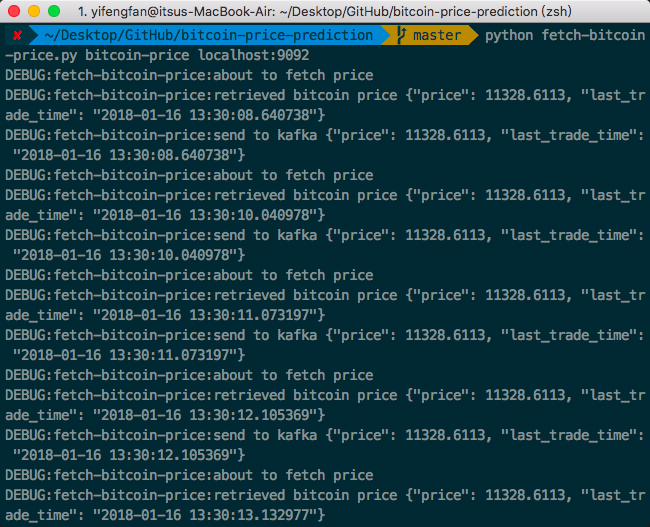
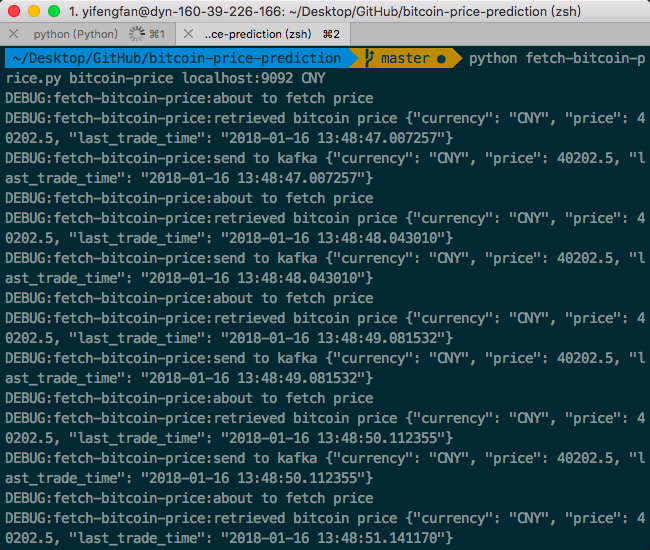

Bitcoin Price Prediction Platform (ongoing)
================

Introduction
------------

A data pipeline predicting the Bitcoin price and sending the alert to subscribers.

Data Source
-----------

-   [Bitcoin API](https://api.coinmarketcap.com/v1/ticker/bitcoin/)
-   [Twitter API](https://github.com/tweepy/tweepy/)

Data Ingestion
--------------

-   Kafka: real time (good scalability, robustness)
### 1/16 update: commit data producer
-  User can specify currency and fetch bitcoin price by running fetch-bitcoin-price.py. 
-  Bitcoin price will be sent to any kafka topic specified by user.
-  Code can be found here: [fetch-bitcoin-price.py](fetch-bitcoin-price.py). Screenshot:

Data Storage
------------

-   Cassandra

Data Computation
----------------

-   Spark

Cluster Scheduling Layer
------------------------

-   Mesos

Reference
---------

[Bitcoin Price Prediction using Sentiment Analysis](http://www.ee.columbia.edu/~cylin/course/bigdata/projects/)
